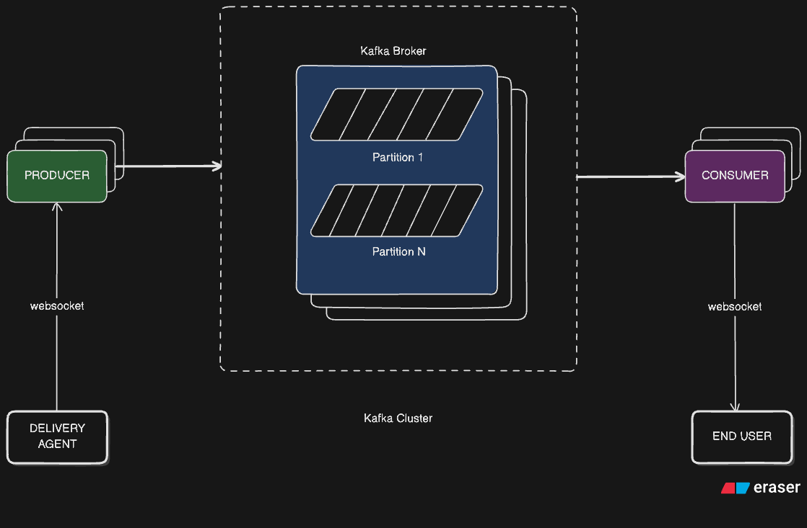

# 🚖 Live Location Tracker

A microservices-based project to simulate **real-time driver location tracking**, inspired by how apps like **Ola, Uber, Swiggy** track delivery agents and cabs.  
The project demonstrates how to ingest driver location data, stream it using **Kafka**, and broadcast live updates to end users via **WebSockets** with a simple **frontend map**.

---

## 📌 Architecture

- **Delivery Agent (Driver App)** → Sends GPS coordinates via WebSocket.  
- **Producer Service (gps-ingestion-service)** → Publishes location updates to Kafka topic.  
- **Kafka Cluster** → Handles event streaming across partitions.  
- **Consumer Service (tracking-websocket-service)** → Consumes messages and forwards them to WebSocket clients.  
- **Frontend (demo.html)** → Displays source, destination, and live driver movement on a map.

---

## 🏗️ Modules

### 1. gps-ingestion-service
- A Spring Boot microservice.  
- Acts as a **Kafka Producer**.  
- Accepts driver’s location updates and publishes them to Kafka.  

### 2. tracking-websocket-service
- A Spring Boot microservice.  
- Acts as a **Kafka Consumer**.  
- Subscribes to location topic and pushes live updates to frontend clients via WebSocket.  

### 3. shared-dto
- Shared module containing `LocationSnapshot` and other DTOs used across services.  

### 4. demo.html
- A lightweight frontend built with **Leaflet.js**.  
- Connects to WebSocket and shows real-time driver movement on a **Google Maps-like UI**.  

---

## ⚙️ Tech Stack

- **Backend**: Java 17, Spring Boot, Kafka  
- **Frontend**: HTML, CSS, JavaScript, Leaflet.js  
- **Messaging**: Apache Kafka  
- **Realtime**: WebSockets  
- **Build Tools**: Maven  

---

